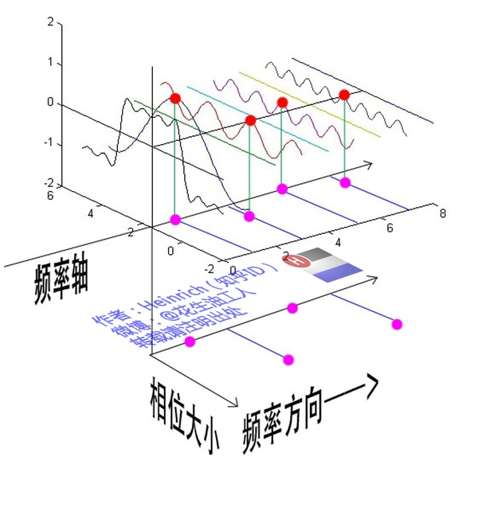
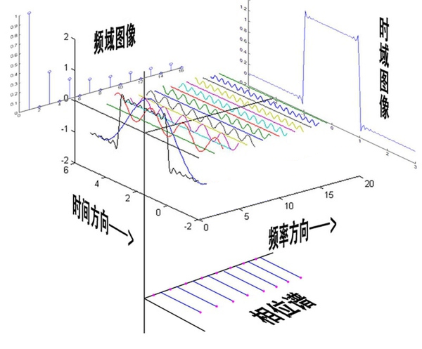
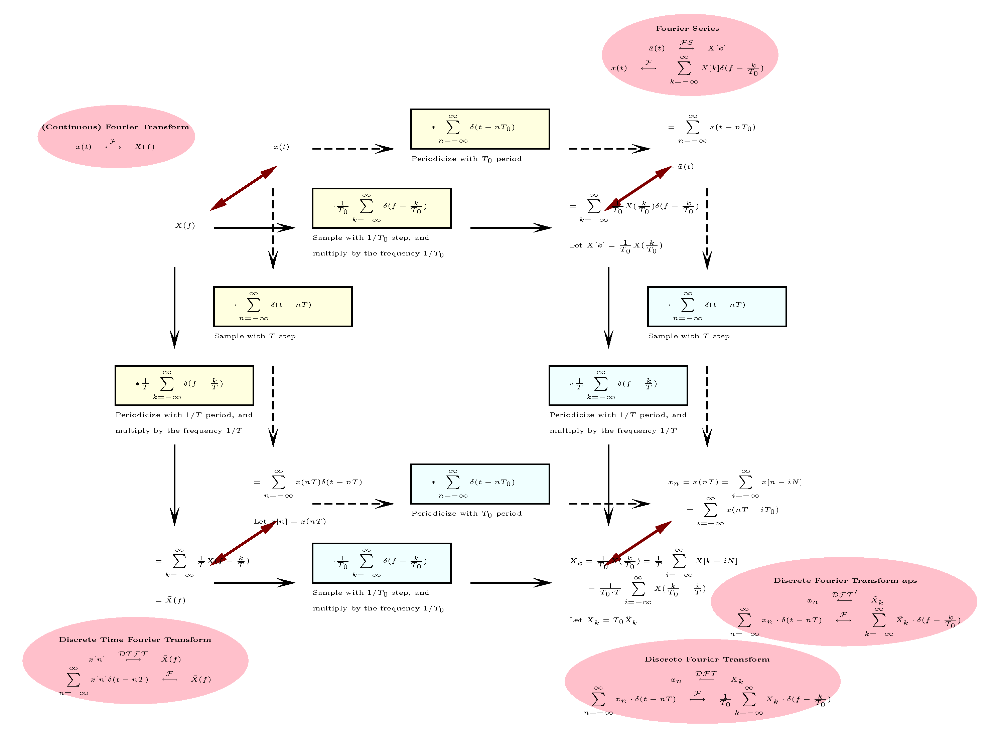
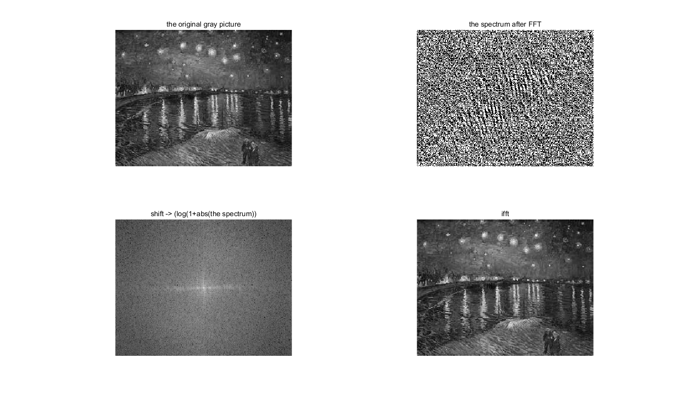
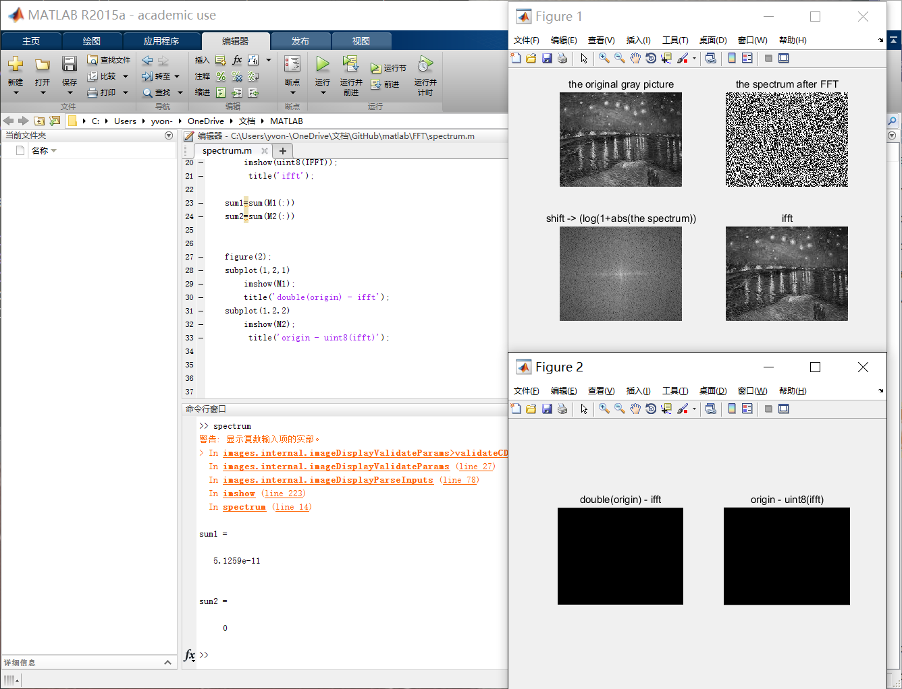

#基础知识：傅里叶变换

##傅里叶变换的物理意义: 时间域 <-> 频域的转换

傅立叶原理表明：任何连续测量的时序或信号，都可以表示为不同频率的正弦波信号的无限叠加

推荐一篇关于傅里叶变换的文章 - [掐死傅里叶教程](http://zhuanlan.zhihu.com/wille/19763358)


傅里叶变换示意图


时域-相位



时域-频域-相位




##傅里叶变换的种类

|**变换**|**时间**|**频率**|
|-------|-----|-----|
|连续傅里叶变换|连续，非周期性|连续，非周期性|
|傅里叶级数|连续，周期性|离散，非周期性|
|离散时间傅里叶变换|离散，非周期性|连续，周期性|
|离散傅里叶变换|离散，周期性|离散，周期性| 
 
 mapping
 - 时间的连续     <-->频率的非周期性
 - 时间的离散     <-->频率的周期性
 - 时间的非周期性  <-->频率的连续
 - 时间的周期性   <-->频率的离散
 
 
 FFT是DFT(离散傅里叶变换的快速实现)
 
## 快在哪里？
 
 DFT：按定义求值需要O(N^2)次运算
 
 FFT：利用库利-图基算法，以分治法为策略递归地将长度为N=N1*N2的DFT分解为长度为N1的N2个较短序列的DFT
 

 
通过许多小的更加容易进行的变换去实现大规模的变换，降低了运算要求，提高了与运算速度， 复杂度降低到O(N*logN)。FFT不是DFT的近似运算，它们完全是等效的。
 
 时间抽取算法
       基2按时间奇偶抽取的FFT
            
 频率抽取算法
       也分奇偶
       
       
       
 W_N^nk=e^(-j*2*Pi*nk/N) 
 对称 周期 可约性 特殊点
 
 
 
 
 
 
 
 
 ### 傅里叶变换的种类与之间的关系




##为什么选择正弦函数？

###正弦函数的优势
正交基

压缩拉伸平移

##傅里叶变换的优势
- 傅立叶变换是线性算子,若赋予适当的范数,它还是酉算子;
- 傅立叶变换的逆变换容易求出,而且形式与正变换非常类似;
- 正弦基函数是微分运算的本征函数,从而使得线性微分方程的求解可以转化为常系数的代数方程的求解.在线性时不变系统的卷积运算为简单的乘积运算,从而提供了计算卷积的一种简单手段;
- 离散形式的傅立叶的物理系统内,频率是个不变的性质,从而系统对于复杂激励的响应可以通过组合其对不同频率正弦信号的响应来获取;
- 著名的卷积定理指出:傅立叶变换可以化复变换可以利用数字计算机快速的算出(其算法称为快速傅立叶变换算法(FFT))。


##弊端

只能处理线性

- 傅里叶变化：只能对能量有限的信号进行变换（也就是可以收敛的信号），无法对能量无限的信号进行变换（无法收敛的）

- 拉普拉斯变换（拉氏变换）：在原先的傅里叶变换公式中乘以一个衰减因子，使得能量无限的信号也能进行时频变换。

- Z变换就是离散信号的拉氏变换。

只能在全局范围内处理信号
    
- 短时傅里叶变换 - 加窗与延拓
- 小波函数 - 加窗 

时域和频域的局部化矛盾

-频域分辨率和时域分辨率高精度不能同时达到

```
从傅里叶变换公式可以看出，它是以正弦波及其高次谐波为标准基的，因此它是对信号的一种总体上的分析，具有单一的局部定位能力，也就是在时域的良好定位是以频域的全部信号分析为代价的，对频域的良好定位是以时域的全部信号分析为代价的，时域和频域分析具有分析的矛盾，傅立叶变换的频率谱中要么频率是准确的而时间是模糊的，要么时间是准确的而频率是模糊的，它不可能同时在时域和频域都具有良好的定位的能力。
```

-时域和频域信息的绝对分离
```
在频域不包含任何时域信息，在时域中同样找不到任何频域信息的影子。对于傅立叶频谱中的某一频率，不知道这一频率是何时产生的，只能从全局上分析信号.
```
不能处理非平稳非线性时变信号

##基只能是唯一的么？

正交基的概念

其他函数变换：小波变换（小波函数）、hht变换(本征模态函数)

---------------------


#二维图像的频域

一维信号的频域，我的个人理解
```
将信号拆分为几种频率的信号，而对于某一个频率的信号来说，频率决定了这个信号变换的快慢。

```

图像的频率是表征图像中**灰度变化剧烈程度**的指标，是灰度在平面空间上的梯度。

如：大面积的沙漠在图像中是一片灰度变化缓慢的区域，对应的频率值很低；而对于地表属性变换剧烈的边缘区域在图像中是一片灰度变化剧烈的区域，对应的频率值较高。

实际上对图像进行二维傅立叶变换得到频谱图，就是图像梯度的分布图，当然频谱图上的各点与图像上各点并不存在一一对应的关系，即使在不移频的情况下也是没有。

傅立叶频谱图上我们看到的明暗不一的亮点，实际上图像上某一点与邻域点差异的强弱，即梯度的大小，也即该点的频率的大小（可以这么理解，图像中的低频部分指低梯度的点，高频部分相反）。

一般来讲，梯度大则该点的亮度强，否则该点亮度弱。这样通过观察傅立叶变换后的频谱图，也叫功率图，我们首先就可以看出，图像的能量分布，如果频谱图中暗的点数更多，那么实际图像是比较柔和的（因为各点与邻域差异都不大，梯度相对较小），反之，如果频谱图中亮的点数多，那么实际图像一定是尖锐的，边界分明且边界两边像素差异较大的。

对频谱移频到原点以后，可以看出图像的频率分布是以原点为圆心，对称分布的。将频谱移频到圆心除了可以清晰地看出图像频率分布以外，还有一个好处，它可以分离出有周期性规律的干扰信号，比如正弦干扰，一副带有正弦干扰，移频到原点的频谱图上可以看出除了中心以外还存在以某一点为中心，对称分布的亮点集合，这个集合就是干扰噪音产生的，这时可以很直观的通过在该位置放置带阻滤波器消除干扰。
##代码演示
```MATLAB
rgb3=imread('pic.jpg');
I=rgb2gray(rgb3);

FFT=fft2(I);
IFFT=ifft2(FFT);

figure(1);
subplot(2,2,1)
    imshow(I);
    title('the original gray picture');
subplot(2,2,2)
    imshow(FFT); 
     title('the spectrum after FFT');
subplot(2,2,3)
    imshow(fftshift(log(1+abs(FFT))),[]);
     title('shift -> (log(1+abs(the spectrum))');
subplot(2,2,4)
    imshow(uint8(IFFT));
     title('ifft');

```


##彩色图像的傅里叶变换
分为RGB三通道执行FFT


#傅里叶变换的误差


在测试原图像和反傅里叶变换后的图像之间的差异时，我将原图像的矩阵强制类型转换为double，后与反傅里叶图像的矩阵相减。
所得矩阵遍历求和为非零，也就是存在误差。

并且单独用两重for循环测试了图像中间的部分，发现并不是边界的问题。

而另一个求和是都转换成uint8 8位无符号整数，精度下降，我有理由推测，是精度的问题。
而非吉布斯现象。



FFT在数学上是完全可逆的。

但是数字在计算机的中的存储是有精度的。

因为这个变换采用了浮点运算，因此需要足够的精度，以使在出现舍入误差时，结果中的每个组成部分的准确整数值仍是可辨认的。为了FFT的舍入误差，应该允许增加几倍log_2(log_2(N))位的二进制。以256为基数、长度为N字节的数可以产生大到(256)^2N阶的卷积分量，所以为了正确存储，需要16+log_2(N)位精度，若数i是浮点尾数的二进制位数，则有条件： 

16+log_2(N)+x*log_2(log_2(N))<i

如果i=24，对于任意感兴趣（N>256）的N值，单精度是不合适的；如果i=53，也就是采用双精度，则允许N大于106，相当于几百万十进制位。所以，用FFT作大数乘法时，向量数组选用双精度类型。


##吉布斯现象

吉布斯现象Gibbs phenomenon（又叫吉布斯效应）： 将具有不连续点的周期函数（如矩形脉冲)进行傅立叶级数展开后，选取有限项进行合成。当选取的项数越多，在所合成的波形中出现的峰起越靠近原信号的不连续点。当选取的项数很大时，该峰起值趋于一个常数，大约等于总跳变值的9%。

由于子图像的变换系数在边界不连续 ，而将造成复原的子图像在其边界也不连续 。于是由复原子图像构成的整幅复原图像将呈现隐约可见的以子图像尺寸为单位的方块状结构，影响整个图像质量 。当子图像尺寸较小时更为严重。

阶跃信号不可以用正弦波叠加得到(能量近似)。


###解决方法
二维余弦变换（DCT）代替二维傅里叶变换。

基本思路为：用一个对称的 2Nx2N  像素的子图像代替原来NxN 子图像。由于对称性， 子图像作二维付立叶变换，其变换系数将只剩下实数的余弦项。这样，即可消除Gibbs现象。