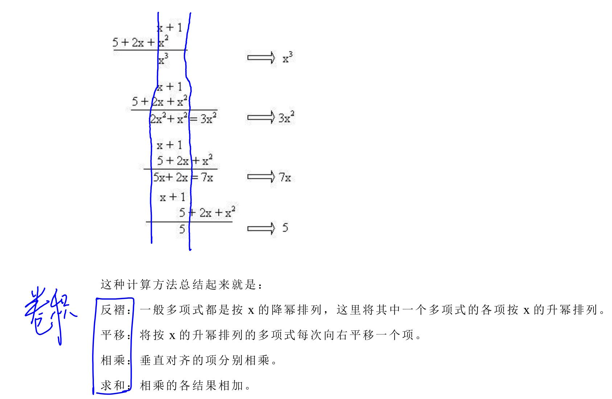
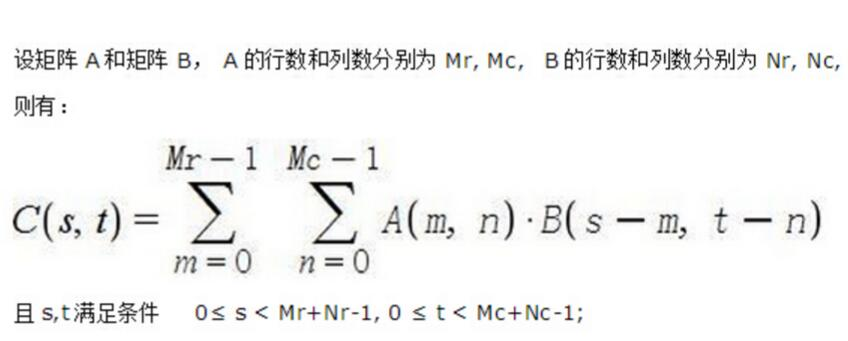
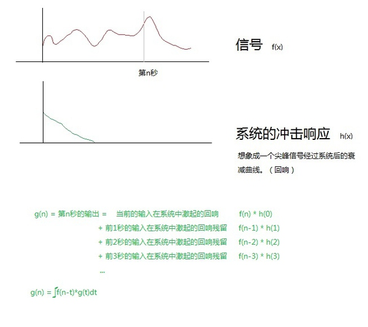
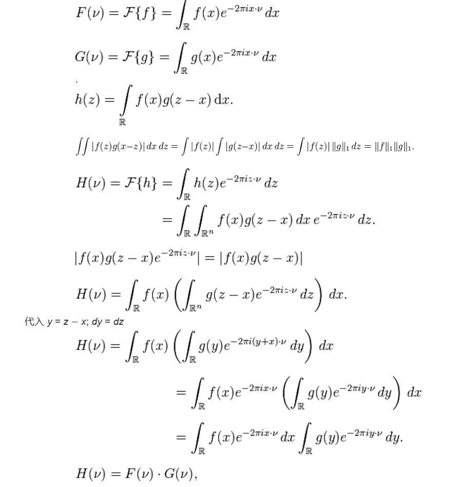

#内积
(a1,b1,c1)·(a2,b2,c2)=a1\*a2+b1\*b2+c1\*c2
#相关
有一个和卷积很容易混淆的概念，叫做相关

首先我们来比较一下：

	自相关函数	R(x)=∫f(t)f(t-x)dt 	移-积-和
	卷积          g(x)=∫f(x)f(t-x)dt    褶-移-积-和
相关和卷积只差一个反转的过程

相关描述的是：把一个信号 平移一段后，与原函数的相似程度

具体怎么个【褶-移-积-和】后面再讲

##相关的物理意义
相关最早是用来概率论中描述随机变量之间关系的概念，如相关系数。

实际上信号一般是一个随机过程，为了实现信号的检测、识别与提取，经常要了解两个信号的相似性，或一个信号经过一段延迟后自身的相似性。
但相关系数有缺陷。

因为分子是两个信号的内积，如sinx和cosx,从波形上看只是相位不同，而相关系数为零（因为正弦和余弦正交），因此引进相关函数，将原来两函数直接内积改为一个函数和另一个函数的延迟作内积。

其实二者从概念没有任何联系。由于相关函数第一个函数和第二个函数的延迟作内积（内积就是乘积累加），所以相关函数不满足交换，而卷积可以。延迟不同结果不同，所以相关系数是个数，而相关函数是函数，是**延迟**的函数。

#卷积

在泛函分析中，卷积是通过两个函数f和g生成第三个函数的一种数学算子，表征函数f与 经过**翻转**和**平移**的g 的重叠部分的累积。
如果将参加卷积的一个函数看作区间的指示函数，卷积还可以被看作是“滑动加权平均”的推广。

##一维信号

g(x)=∫f(x)f(t-x)dt 
```
褶：f(x) -> f(-x)
移：f(-x) -> f(t-x)
积：f(x)f(t-x)
和：∫f(x)f(t-x)dt
```

反转平移之后重叠部分做内积(乘积累加)

某种意义上，对任意一个t，h(t)对它做了一个**相同模式**的贡献／变化


##一些便于理解的例子
辐射：设某核电站事故中，某工作人员每天到抢险现场工作T分钟，接受一定剂量的辐射，辐射会自然地衰减，如此工作N天，如何计算总的辐射量？

信号：一个物体时刻会受到一个周期性的固定模式的的能量的冲击。并且，物体在受到某个时刻的能量后，会按照一个关于时间的函数进行变化。
如何计算 某个时刻 之前所有冲击信号的遗留和现在受到的冲击信号的能量之和？

复利：

|**本金**|**第一年**|**第二年**|**第三年**|**第四年**|**第五年**|
|-------|----------|----------|---------|---------|-----------|
|+100  |100*(1.05)^1     | 100*(1.05)^2    | 100*(1.05)^3        | 100*(1.05)^4     | 100*(1.05)^5   | 
|  | +200    | 200*(1.05)^1    | 200*(1.05)^2        | 200*(1.05)^3     | 200*(1.05)^4   | 
|  |     | +300    | 300*(1.05)^1        | 300*(1.05)^2     | 300*(1.05)^3   | 
|  |     |     | +300        | 300*(1.05)^1     | 300*(1.05)^2   | 
|  |     |     |         | +200     | 200*(1.05)^1   | 
|  |     |     |         |      |+100    | 

多项式乘法：


多项式a(n1)乘多项式b(n2)

对应的系数矩阵(向量)为a[最高次的系数,...,常数项系数] 和 b[最高次的系数,...,常数项系数]

多项式相乘结果的系数为c[最高次的系数,...,常数项系数]
```
c(i)=\sum_{k=0}^i a(k)b(i-k),i=0~(n1+n2)
```
##二维图像

对应一维信号处理过程，把时间t的定义域空间换成图像的平面矩阵形状空间

###二维离散卷积公式


###二维连续卷积公式
(f*g)(t1,t2)=∫∫f(x1,x2)g(t1-x1,t2-x2)dx1 dx2

###一些例子的理解
####将图像按照模板进行处理

对于图像而言，离散卷积的计算过程是模板翻转，然后在原图像上滑动模板，把对应位置上的元素相乘后加起来，得到最终的结果。如果不考虑翻转，这个滑动-相乘-叠加的过程就是相关操作。

####滤波
比如最简单的高斯模板，就是把模板内像素乘以不同的权值然后加起来作为模板的中心像素值，如果模板取值全为1，就是滑动平均；如果模板取值为高斯，就是加权滑动平均，权重是中间高，四周低，在频率上理解就是低通滤波器。


####投影
因为当前模板内部图像和模板的相乘累加操作就是图像局部片段和模板的内积操作，这个过程可以看作图像的片段的空间 向 模板空间上的投影，一幅图像和一个模板卷积，得到的结果就是图像各个片段在这个空间上的投影累加和。如果这样的模板有一组，我们可以把这一组看成一组基，常见的如用一组Garbor滤波器提取图像的特征。


##总的来说

在泛函分析中，卷积是通过两个函数f 和g 生成第三个函数的一种数学算子，表征函数f 与经过翻转和平移的g的重叠部分的累积。如果将参加卷积的一个函数看作区间的指示函数，卷积还可以被看作是“滑动加权平均”的推广。

（赋予不同的权值的想法）（加权累加）

二者在时间上不一定同步。卷积关心的正是二者在时间不同步的情况下（各个时间）激励和响应作用的结果。并且，这种响应是非因果的，即是不仅要考虑某一时刻输入信号的响应，还要全部包含这之前所有输入的响应。


###离散卷积：
图像本身是离散的 所以权值也是离散的,模板是格子般的

忽略远距离的像素点的低权值影响，所以模板是有限的格子

权值分布的按照不同的函数分布，便是不同的卷积核，只不过受像素格的影响，是取离散的值。

整体就是个：褶 -> 移 -> 积 -> 和  的过程


###卷积的类型
####离散卷积和连续函数的卷积
####线性卷积和循环卷积
通常说卷积时指的是线性卷积，在信号处理领域是跟线性时不变系统有关的一种运算

循环卷积我理解是使用DFT(FFT)计算线性卷积时的衍生品。

##一些问题：


##为什么要反转？

卷积的其中一方参与者是冲击响应，它所描述的的曲线方向与时间流逝一致。而卷积的输出等于以前的信号效果累加，这个累加必然从当前时间点逆时间流逝方向进行的。很显然，离当前时间越近，那个输入残留在系统中的回响就越大。

也可以从之前的多项式乘法的解释上理解。


##卷积核可不可以是改变的？
某种意义上，对任意一个t，h(τ)对它做了一个相同模式的贡献／变化

h(t)能否是变化的？

g(x)=∫f(x)(t-x)dt   ----->   g(x)=∫f(x)f(x,t-x)dt

比如考虑边缘情况，边缘时模板就不相同了。

##模板的大小是有限的
二维卷积时 什么情况才能忽略远距离的像素值呢？万一远距离的像素的权值更高呢？

（收敛的想法 h(t)得是收敛的）


###线性时不变系统
连续时间系统与离散时间系统
	
	线性系统有两种定义：
	（1）根据系统的输入和输出关系是否具有线性来定义满足叠加原理的系统具有线性特性。即若对两个激励x1(n)和x2(n)，有T[ax1(n)+bx2(n)]=aT[x1(n)]+bT[x2(n)]，式中a、b为任意常数。不满足上述关系的为非线性系统。
	（2）根据组成系统的元件特性来定义由线性元件和独立电源组成的系统。
时不变系统

	系统的参数不随时间而变化，即不管输入信号作用的时间先后，输出信号响应的形状均相同，仅是从出现的时间不同。用数学表示为T[x(n)]=y[n]则 T[x(n-n0)]=y[n-n0]，这说明序列x(n)先移位后进行变换与它先进行变换后再移位是等效的。 

线性时不变系统
	
	既满足叠加原理又具有时不变特性，它可以用单位脉冲响应来表示。单位脉冲响应是输入端为单位脉冲序列时的系统输出，一般表示为h(n)，即h(n)=T[δ(n)]。 
	任一输入序列x(n)的相应y(n)=T[x(n)]=T[ δ(n-k)]； 
	由于系统是线性的，所以上式可以写成y(n)=T[δ(n-k)]；
	又由于系统是时不变的，即有T[δ(n-k)]＝h(n-k)；
	从而得y(n)=h(n-k)=x(n)*h(n)； 　　
	这个公式称为离散卷积，用“*”表示。


#卷积定理


两个函数卷积后的傅里叶变换=两个函数的傅里叶变换后的乘积


卷积定理指出，函数卷积的傅里叶变换是函数傅里叶变换的乘积。即一个域中的卷积对应于另一个域中的乘积，例如时域中的卷积对应于频域中的乘积。
这一定理对拉普拉斯变换、双边拉普拉斯变换、Z变换、Mellin变换和Hartley变换等各种傅里叶变换的变体同样成立。在调和分析中还可以推广到在局部紧致的阿贝尔群上定义的傅里叶变换。
利用卷积定理可以简化卷积的运算量。对于长度为n的序列，按照卷积的定义进行计算，需要做2n-1组对位乘法，其计算复杂度为O(n^2)；而利用傅里叶变换将序列变换到频域上后，只需要一组对位乘法，利用傅里叶变换的快速算法之后，总的计算复杂度为O(n*log n)。这一结果可以在快速乘法计算中得到应用。

