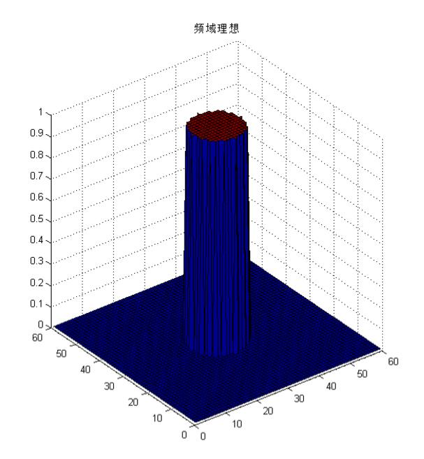
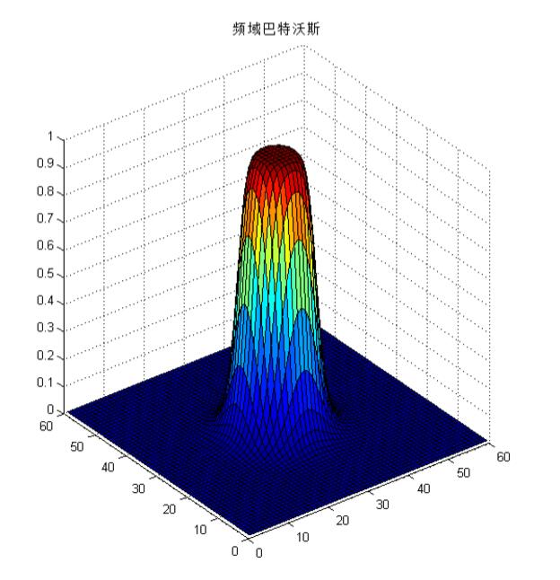
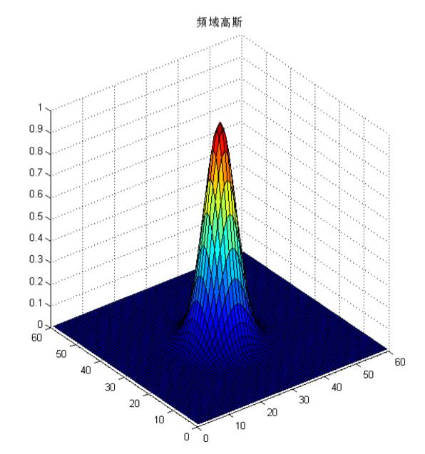
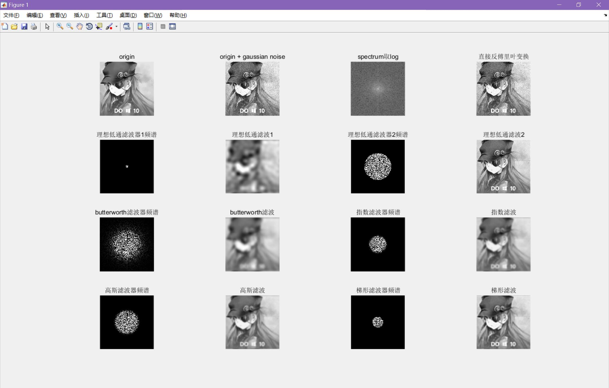

#噪声


高斯噪声：是指噪声服从高斯分布，即某个强度的噪声点个数最多，离这个强度越远噪声点个数越少，且这个规律服从高斯分布。高斯噪声是一种加性噪声，即噪声直接加到原图像上，因此可以用线性滤波器滤除。
主要由阻性元器件内部产生

椒盐噪声：类似把椒盐撒在图像上，因此得名，是一种在图像上出现很多白点或黑点的噪声，如电视里的雪花噪声等。椒盐噪声可以认为是一种逻辑噪声，用线性滤波器滤除的结果不好，一般采用中值滤波器滤波可以得到较好的结果。
主要是图像切割引起的黑图像上的白点噪声或光电转换过程中产生的泊松噪声


加性噪声一般指热噪声、散弹噪声等，它们与信号的关系是相加，不管有没有信号，噪声都存在。

乘性噪声一般由信道不理想引起，它们与信号的关系是相乘，信号在它在，信号不在他也就不在。
一般通信中把加性随机性看成是系统的背景噪声；而乘性随机性看成系统的时变性（如衰落或者多普勒）或者非线性所造成的。


#降噪
空域滤波

        线性滤波：均值滤波，高斯滤波
        非线性滤波：中值滤波，边缘保持滤波（任何不是像素加权运算的滤波器都属于非线性滤波器）
频域滤波

        理想滤波器
        butterworth滤波器
        指数滤波器
        梯形滤波器
        高斯滤波器


# 低通滤波

##图像的频率

一副图像的边缘、跳跃部分以及颗粒噪声代表图像信号的高频分量

而大面积的背景区则代表图像信号的低频信号

用滤波的方式滤除其高频部分就能去掉噪声。

再进行反傅里叶变换，便能得到平滑图像


G(u,v)=H(u,v)F(u,v)

光滑函数=滤波器变换函数*傅里叶变换原函数

（卷积的概念）

g(x,y)=h(x,y)*f(x,y)


###卷积定理

卷积定理指出，函数卷积的傅里叶变换是函数傅里叶变换的乘积。即一个域中的卷积对应于另一个域中的乘积，例如时域中的卷积对应于频域中的乘积。

利用卷积定理可以简化卷积的运算量。对于长度为n的序列，按照卷积的定义进行计算，需要做2n-1组对位乘法，其计算复杂度为\mathcal{O}(n^2)；而利用傅里叶变换将序列变换到频域上后，只需要一组对位乘法，利用傅里叶变换的快速算法之后，总的计算复杂度为\mathcal{O}(n\log n)。这一结果可以在快速乘法计算中得到应用。


#低通滤波器


高低通的区别 

本质上就是给高低频率赋予不同的权值，进行变换。


使用理想滤波器时，很容易出现振铃效应，为了使频率变化变得平滑，则不再使用简单粗暴的0-1权值，而根据距离零频率距离来选择不同的函数

不同的函数，不同滤波器，则每个频率的信号的减弱程度不同。
 

##理想滤波器
```
D(u,v)<=D_0时 
H(u,v)=1

D(u,v)>D_0时 
H(u,v)=0
```
D(u,v)是(u,v)点距离频率矩形原点的距离


### 如何确定D_0？

**不能自适应！！！**


###物理上的不能实现
理想滤波器为什么不能实现?

因为电感电容都是非线性的,高频的分布参数影响特性从而无法实现理想化。电源滤波器是由电容、电感和电阻组...


## Butterworth滤波器

```
H(u,v)=1/{1+[D(u,v)/D_0]^(2n)}
```



##指数滤波器
```
H(u,v)=exp{[-D(u,v)/D_0]^n }
```
###n是决定衰减率的系数


##高斯滤波器

```
H(u,v=1-exp{ -1/2*[D(u,v)/D_0]^2 }
```


###梯形低通滤波器
```
D(u,v) < D_0时
H(u,v)=1

D_0<=D(u,v)<=D_1时
H(u,v)=\[ D(u,v)-D_1 \]/(D_0-D_1)

D_1 < D(u,v)时
H(u,v)=0
```


#一些发现的问题

###低通滤波的根本是去掉高频 那么空域转频域 一定要用傅里叶变换么？

##如何确定截止频率（阈值），以及如何自适应？


##滤波过程会出现负值或者溢出
uint8形式的数据时会截断处理，将小于0的变成0.

##模糊和振铃
所谓“振铃”，就是指输出图像的灰度剧烈变化处产生的震荡，就好像钟被敲击后产生的空气震荡。


空间域将低通滤波作为卷积过程来理解的关键是h(x,y)的特性：可将h(x,y)分为两部分：原点处的中心部分，中心周围集中的成周期分布的外围部分。前者决定模糊，后者决定振铃现象。若外围部分有明显的震荡，则g(x,y)会出现振铃。利用傅里叶变换，我们发现，若频域滤波函数具有陡峭变化，则傅里叶逆变换得到的空域滤波函数会在外围出现震荡。


#带通和带阻
带通滤波器容许一定频率范围信号通过, 但减弱(或减少)频率低于於下限截止频率和高于上限截止频率的信号的通过。

带阻滤波器减弱(或减少)一定频率范围信号, 但容许频率低于於下限截止频率和高于上限截止频率的信号的通过。


#同态滤波

一般来说，图像的边缘和噪声都对应于傅立叶变换的高频分量。而低频分量主要决定图像在平滑区域中总体灰度级的显示，故被低通滤波的图像比原图像少一些尖锐的细节部分。同样，被高通滤波的图像在图像的平滑区域中将减少一些灰度级的变化并突出细节部分。为了增强图像细节的同时尽量保留图像的低频分量，使用同态滤波方法 可以保留图像原貌的同时，对图像细节增强.

同态滤波是把频率过滤和灰度变换结合起来的一种图像处理方法，它依靠图像的照度/ 反射率模型作为频域处理的基础，利用压缩亮度范围和增强对比度来改善图像的质量。使用这种方法可以使图像处理符合人眼对于亮度响应的非线性特性，避免了直接对图像进行傅立叶变换处理的失真。

同态滤波的基本原理是：将像元灰度值看作是照度和反射率两个组份的产物。由于照度相对变化很小，可以看作是图像的低频成份，而反射率则是高频成份。通过分别处理照度和反射率对像元灰度值的影响，达到揭示阴影区细节特征的目的。
同态滤波处理的基本流程如下：

S(x,y)---->Log---->DFT---->频域滤波---->IDFT---->Exp---->T(x,y)

其中S(x,y)表示原始图像；T(x,y)表示处理后的图像；Log 代表对数运算；DFT 代表傅立叶变换（实际操作中运用快速傅立叶变换FFT）；IDFT 代表傅立叶逆变换（实际操作中运用快速傅立叶逆变换IFFT）；Exp 代表指数运算。


#结果
##椒盐噪声


##高斯噪声



#后续的问题（太多了还没来得及做）
- butterworth滤波器 迭代次数n如何影响滤波效果 如何影响振铃效应的程度
- 指数滤波器 为什么是平方 能多次方么
- 梯形滤波器 上下限对滤波的影响
- 高斯滤波器 不同的高斯函数  高斯函数的傅里叶变换仍然是高斯函数，故高斯型滤波器不会产生“振铃“。
- 不同种类的滤波器的适用对象？ 

#代码


```
RGB=imread('1.jpg');
I=rgb2gray(RGB);
J=imnoise(I,'gaussian',0,0.005);    %手动添加高斯噪声
%J=imnoise(I,'salt & pepper',0.02);    %手动添加椒盐噪声
FFT=fft2(J);%shift


IFFT_0=uint8(ifft2(FFT));


[a,b]=size(FFT);
a0=round(a/2);
b0=round(b/2);


%%%%%%%%%理想低通滤波器1
n1=10;%确定范围
disnoise_1=fftshift(FFT);
for i=1:a
    for j=1:b
        distance=sqrt((i-a0)^2+(j-b0)^2);
        if distance <= n1
            h=1;
        else
            h=0;
        end;
        disnoise_1(i,j)=h*disnoise_1(i,j);
    end;
end;
IFFT_1=uint8((ifft2(ifftshift(disnoise_1))));


%%%%%%%%%理想低通滤波器2
n2=100;%确定范围
disnoise_2=fftshift(FFT);
for i=1:a
    for j=1:b
        distance=sqrt((i-a0)^2+(j-b0)^2);
        if distance <= n2
            h=1;
        else
            h=0;
        end;
        disnoise_2(i,j)=h*disnoise_2(i,j);
    end;
end;
IFFT_2=uint8(real(ifft2(ifftshift(disnoise_2))));


%%%%%%%% Butterworth滤波器

D_3=10;%通带半径
n3=2;%滤波次数
disnoise_3=fftshift(FFT);
for i=1:a
    for j=1:b
        distance=sqrt((i-a0)^2+(j-b0)^2);
        h=1/(1+(distance/D_3)^(2*n3));
        disnoise_3(i,j)=h*disnoise_3(i,j);
    end;
end;
IFFT_3=uint8(real(ifft2(ifftshift(disnoise_3))));


%%%%%%%% 指数滤波器

D_4=20;%通带半径
n4=2;%滤波次数
disnoise_4=fftshift(FFT);
for i=1:a
    for j=1:b
        distance=sqrt((i-a0)^2+(j-b0)^2);
        h=expm(-(distance/D_4)^n4);
        disnoise_4(i,j)=h*disnoise_4(i,j);
    end;
end;
IFFT_4=uint8(real(ifft2(ifftshift(disnoise_4))));


%%%%%%%% 高斯滤波器

D_5=20;%通带半径
disnoise_5=fftshift(FFT);
for i=1:a
    for j=1:b
        distance=sqrt((i-a0)^2+(j-b0)^2);
        h=expm(-(distance^2/(2*D_5^2)));
        disnoise_5(i,j)=h*disnoise_5(i,j);
    end;
end;
IFFT_5=uint8(real(ifft2(ifftshift(disnoise_5))));


%%%%%%%% 梯形低通滤波器

D_6_1=20;%通带半径
D_6_2=40;
disnoise_6=fftshift(FFT);
for i=1:a
    for j=1:b
        distance=sqrt((i-a0)^2+(j-b0)^2);
        if distance<D_6_1
            h=1;
        else
            if distance<=D_6_2
                h=((distance-D_6_2)/(D_6_1-D_6_2));
            else
                h=0;
            end;
        end;
        disnoise_6(i,j)=h*disnoise_6(i,j);
    end;
end;
IFFT_6=uint8(real(ifft2(ifftshift(disnoise_6))));


figure(1);
subplot(4,4,1)
    imshow(I);
    title('origin');
subplot(4,4,2)
    imshow(J);
    title('origin + gaussian noise');
subplot(4,4,3)
    imshow(fftshift(log((fft2(J)))),[]);
    title('spectrum取log');
subplot(4,4,4)
    imshow(IFFT_0);
    title('直接反傅里叶变换');
subplot(4,4,5)
    imshow(disnoise_1);
    title('理想低通滤波器1频谱');
subplot(4,4,6)
    imshow(IFFT_1);
    title('理想低通滤波1');
    
subplot(4,4,7)
    imshow(disnoise_2);
    title('理想低通滤波器2频谱');
subplot(4,4,8)
    imshow(IFFT_2);
    title('理想低通滤波2');
subplot(4,4,9)
    imshow(disnoise_3);
    title('butterworth滤波器频谱');
subplot(4,4,10)
    imshow(IFFT_3);
    title('butterworth滤波');
subplot(4,4,11)
    imshow(disnoise_4);
    title('指数滤波器频谱');
subplot(4,4,12)
    imshow(IFFT_4);
    title('指数滤波');
subplot(4,4,13)
    imshow(disnoise_5);
    title('高斯滤波器频谱');
subplot(4,4,14)
    imshow(IFFT_5);
    title('高斯滤波');
subplot(4,4,15)
    imshow(disnoise_6);
    title('梯形滤波器频谱');
subplot(4,4,16)
    imshow(IFFT_6);
    title('梯形滤波');


```